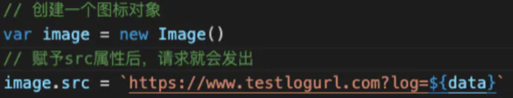
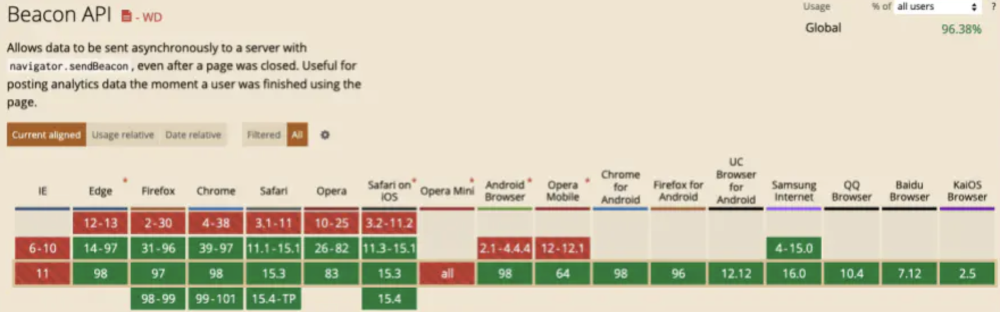

## 前端埋点方法

常见的前端埋点方法分为三种：代码埋点、可视化埋点和无痕埋点。

### 代码埋点

代码埋点，就是以嵌入代码的形式进行埋点，比如需要监控用户的点击事件，会选择在用户点击时，插入一段代码，保存这个监听行为或者直接将监听行为以某一种数据格式直接传递给server端。此外比如需要统计产品的PV和UV的时候，需要在网页的初始化时，发送用户的访问信息等。

代码埋点的优点：

- 可以在任意时刻，精确的发送或保存所需要的数据信息。

缺点：

- 工作量较大，每一个组件的埋点都需要添加相应的代码

### 可视化埋点

通过可视化交互的手段，代替代码埋点。将业务代码和埋点代码分离，提供一个可视化交互的页面，输入为业务代码，通过这个可视化系统，可以在业务代码中自定义的增加埋点事件等等，最后输出的代码耦合了业务代码和埋点代码。

可视化埋点听起来比较高大上，实际上跟代码埋点还是区别不大。也就是用一个系统来实现手动插入代码埋点的过程。

缺点：

- 可视化埋点可以埋点的控件有限，不能手动定制。

服务器=>SDK ==>前端

### 无痕埋点

无埋点并不是说不需要埋点，而是全部埋点，前端的任意一个事件都被绑定一个标识，所有的事件都记录下来。通过定期上传记录文件，配合文件解析，解析出来我们想要的数据，并生成可视化报告供专业人员分析因此实现“无埋点”统计。

从语言层面实现无埋点也很简单，比如从页面的js代码中，找出dom上被绑定的事件，然后进行全埋点。

无埋点的优点：

- 由于采集的是全量数据，所以产品迭代过程中是不需要关注埋点逻辑的，也不会出现漏埋、误埋等现象

缺点：

- 无埋点采集全量数据，给数据传输和服务器增加压力
- 无法灵活的定制各个事件所需要上传的数据

## 埋点数据上报

前端埋点收集到的数据需要上报给服务端，目前较为常用的方案为三种。

### **传统XHR请求**

优点：可以灵活地设置请求头属性，post请求可以发送大体量数据，满足特定场景的埋点需求。

缺点：数据量大的请求占用带宽资源多，增加服务器压力。页面销毁时的监控埋点大概率上报失败。

### **Image对象**

利用图标对象的src属性发送get请求上报数据

优点：上报数据的请求不需要接收响应，可灵活跨域，src请求体量小，速度快，页面销毁时的监控埋点会等上报请求发送完毕，再执行页面卸载。

缺点：无法发送大体量数据，页面销毁时有监控埋点会让页面关闭速度变慢，影响用户体验。

###  Beacon API

Beacon api 是w3c新引入的补充性api，就是用来解决web页面在触发卸载销毁事件unload期间会中断所有异步xhr请求的问题。这个API给navigator对象增加了一个sendBeacon()方法。这个方法接收一个URL和一个数据有效载荷参数，并会发送一个POST请求。可选的数据有效载荷参数有ArrayBufferView、Blob、DOMString、FormData实例。它会保证页面在已经关闭的情况下也会发送请求。

不过它也有缺点：

1.只支持post请求，并且发送的数据量不会像正常xhr的post数据量那么大，最大数据量大小是由客户端（用户浏览器）版本决定的，chrome@70版本测试大概15MB左右。

2.因为是新补充的api，会存在浏览器兼容性问题，如图：

综上，埋点数据上报在上报轻量级的数据时可以采取image src属性进行上报，特定场景需要采集大量级的数据可以改用普通post请求方式，在需要监测用户关闭浏览器时上报数据，首选采用beaconApi方式，若用户的当前浏览器不支持该方法，可降级为image方案。

 BeaconAPI:[https://developer.mozilla.org/zh-CN/docs/Web/API/Beacon_API](https://links.jianshu.com/go?to=https%3A%2F%2Fdeveloper.mozilla.org%2Fzh-CN%2Fdocs%2FWeb%2FAPI%2FBeacon_API)