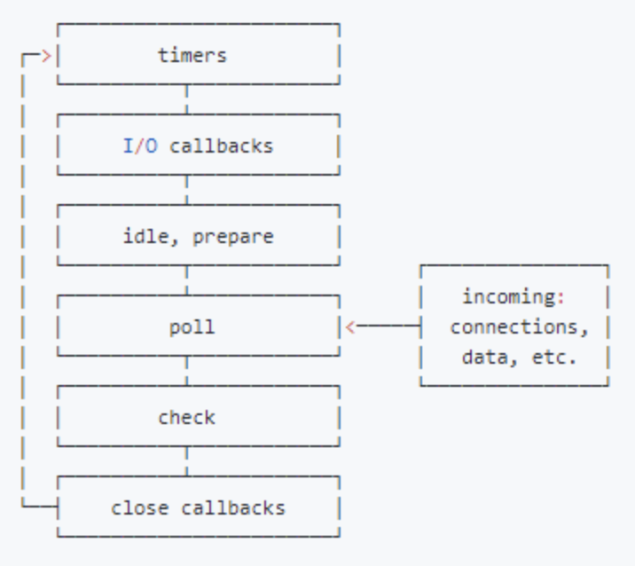

### 为什么会有 Event Loop：

javascript 从诞生之日起就是一门单线程的非阻塞的脚本语言。
而 js 为了实现“非阻塞”，便出现了 event loop（事件循环）。

**单线程**：
单线程意味着，javascript 代码在执行的任何时候，都只有一个主线程来处理所有的任务。（为了防止当两个线程同时对 dom 进行一项操作，例如一个向其添加事件，而另一个删除了这个 dom，此时该如何处理）

**非阻塞**：
而非阻塞则是当代码需要进行一项异步任务（无法立刻返回结果，需要花一定时间才能返回的任务，如 I/O 事件）的时候，主线程会挂起（pending）这个任务，然后在异步任务返回结果的时候再根据一定规则去执行相应的回调。
**Web Worker**：
单线程在保证了执行顺序的同时也限制了 javascript 的效率，因此开发出了 web worker 技术。
这项技术号称让 javascript 成为一门多线程语言。然而，使用 web worker 技术开的多线程有着诸多限制。
例如：
所有新线程都受主线程的完全控制，不能独立执行。这意味着这些“线程” 实际上应属于主线程的子线程。
另外，这些子线程并没有执行 I/O 操作的权限，只能为主线程分担一些诸如计算等任务。
所以严格来讲这些线程并没有完整的功能，也因此这项技术并非改变了 javascript 语言的单线程本质。

### 浏览器中的 Event Loop:

#### 1、执行栈：

针对同步代码：

​ 当一个脚本第一次执行的时候，js 引擎会解析这段代码，并将其中的同步代码按照执行顺序加入执行栈中，然后从头开始执行。如果当前执行的是一个方法，那么 js 会向执行栈中添加这个方法的执行环境，然后进入这个执行环境继续执行其中的代码。当这个执行环境中的代码 执行完毕并返回结果后，js 会退出这个执行环境并把这个执行环境销毁，回到上一个方法的执行环境。。这个过程反复进行，直到执行栈中的代码全部执行完毕。

#### 2、事件队列（Task Queue）

针对异步代码：

​ js 引擎遇到一个异步事件后并不会一直等待其返回结果，而是会将这个事件挂起，继续执行执行栈中的其他任务。当一个异步事件返回结果后，js 会将这个事件加入与当前执行栈不同的另一个队列，我们称之为事件队列。被放入事件队列不会立刻执行其回调，而是等待当前执行栈中的所有任务都执行完毕， 主线程处于闲置状态时，主线程会去查找事件队列是否有任务。如果有，那么主线程会从中取出排在第一位的事件，并把这个事件对应的回调放入执行栈中，然后执行其中的同步代码...，如此反复，这样就形成了一个无限的循环。
这就是这个过程被称为“事件循环（Event Loop）”的原因。

**当当前执行栈执行完毕时会立刻先处理所有微任务队列中的事件，然后再去宏任务队列中取出一个事件。同一次事件循环中，微任务永远在宏任务之前执行**。

### node 中的 Event Loop:

nodejs 的 event loop 分为 6 个阶段，它们会按照顺序反复运行，分别如下：

> 1. timers：执行 setTimeout() 和 setInterval()中到期的 callback。
> 2. I/O callbacks：上一轮循环中有少数的 I/Ocallback 会被延迟到这一轮的这一阶段执行
> 3. idle, prepare：队列的移动，仅内部使用
> 4. poll：最为重要的阶段，执行 I/O callback，在适当的条件下会阻塞在这个阶段
> 5. check：执行 setImmediate 的 callback
> 6. close callbacks：执行 close 事件的 callback，例如 socket.on("close",func)

**微任务和宏任务在 Node 的执行顺序**

Node 10 以前：

- 执行完一个阶段的所有任务
- 执行完 nextTick 队列里面的内容
- 然后执行完微任务队列的内容

Node 11 以后：
和浏览器的行为统一了，都是每执行一个宏任务就执行完微任务队列。



```js
setTimeout(()=>{
    console.log('timer1')

    Promise.resolve().then(function() {
        console.log('promise1')
    })
}, 0)

setTimeout(()=>{
    console.log('timer2')

    Promise.resolve().then(function() {
        console.log('promise2')
    })
}, 0)


浏览器输出：
time1
promise1
time2
promise2

Node 11 之前输出：
time1
time2
promise1
promise2

Node 11 之后输出：
time1
promise1
time2
promise2

```
