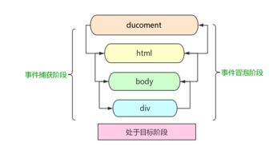

​ **事件代理**（Event Delegation），又称之为事件委托。是 JavaScript 中常用绑定事件的常用技巧。顾名思义，“事件代理”即是把原本需要绑定在子元素的响应事件（click、keydown......）委托给父元素，让父元素担当事件监听的职务。事件代理的原理是 DOM 元素的事件冒泡。

### 事件冒泡

前面提到事件委托的原理是 DOM 元素的事件冒泡，那么事件冒泡是什么呢？

一个事件触发后，会在子元素和父元素之间传播（propagation）。这种传播分成三个阶段



如上图所示，事件传播分成三个阶段：

- 捕获阶段：从 window 对象传导到目标节点（上层传到底层）称为“捕获阶段”（capture phase），捕获阶段不会响应任何事件；
- 目标阶段：在目标节点上触发，称为“目标阶段”
- 冒泡阶段：从目标节点传导回 window 对象（从底层传回上层），称为“冒泡阶段”（bubbling phase）。事件代理即是利用事件冒泡的机制把里层所需要响应的事件绑定到外层；

### 事件委托的优点

**【1】可以大量节省内存占用，减少事件注册，比如在 ul 上代理所有 li 的 click 事件就非常棒**

```html
<ul id="list">
  <li>item 1</li>
  <li>item 2</li>
  <li>item 3</li>
  ......
  <li>item n</li>
</ul>

// ...... 代表中间还有未知数个 li
```

如上面代码所示，如果给每个 li 列表项都绑定一个函数，那对内存的消耗是非常大的，因此较好的解决办法就是将 li 元素的点击事件绑定到它的父元素 ul 身上，执行事件的时候再去匹配判断目标元素。

**【2】可以实现当新增子对象时无需再次对其绑定（动态绑定事件）**

假设上述的例子中列表项 li 就几个，我们给每个列表项都绑定了事件；

在很多时候，我们需要通过 AJAX 或者用户操作动态的增加或者删除列表项 li 元素，那么在每一次改变的时候都需要重新给新增的元素绑定事件，给即将删去的元素解绑事件；

如果用了事件委托就没有这种麻烦了，因为事件是绑定在父层的，和目标元素的增减是没有关系的，执行到目标元素是在真正响应执行事件函数的过程中去匹配的；所以使用事件在动态绑定事件的情况下是可以减少很多重复工作的。

### 基本实现

**【1】JavaScript 原生实现事件委托**

比如我们有这样的一个 HTML 片段：

```html
<ul id="myLinks">
  <li id="goSomewhere">Go somewhere</li>
  <li id="doSomething">Do something</li>
  <li id="sayHi">Say hi</li>
</ul>
```

按照传统的做法，需要像下面这样为它们添加 3 个事 件处理程序

```javascript
var item1 = document.getElementById('goSomewhere')
var item2 = document.getElementById('doSomething')
var item3 = document.getElementById('sayHi')

item1.onclick = function () {
  location.href = 'http://www.baidu.com'
}

item2.onclick = function () {
  document.title = '事件委托'
}

item3.onclick = function () {
  alert('hi')
}
```

如果在一个复杂的 Web 应用程序中，对所有可单击的元素都采用这种方式，那么结果就会有数不 清的代码用于添加事件处理程序。此时，可以利用事件委托技术解决这个问题。使用事件委托，只需在 DOM 树中尽量最高的层次上添加一个事件处理程序，如下面的例子所示

```javascript
var item1 = document.getElementById('goSomewhere')
var item2 = document.getElementById('doSomething')
var item3 = document.getElementById('sayHi')

document.addEventListener('click', function (event) {
  var target = event.target
  switch (target.id) {
    case 'doSomething':
      document.title = '事件委托'
      break
    case 'goSomewhere':
      location.href = 'http://www.baidu.com'
      break
    case 'sayHi':
      alert('hi')
      break
  }
})
```
