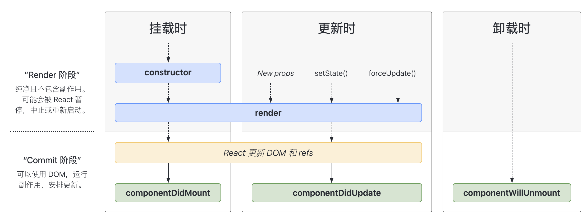
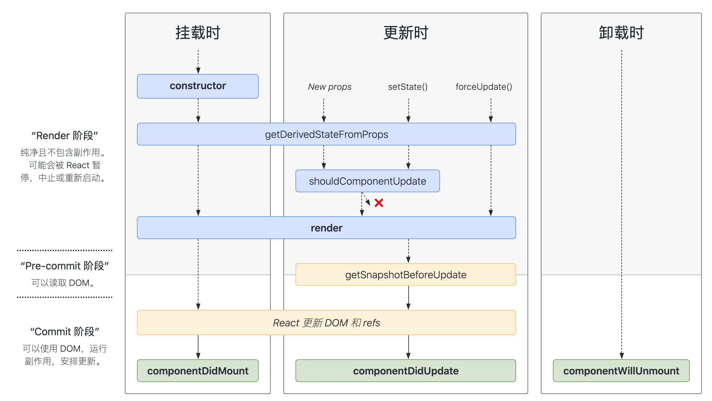

### 1、 常用的生命周期（版本 16.4）



### 2、 包含不常用的生命周期（版本 16.4）



### 3、挂载时生命周期调用顺序 （粗体为常用生命周期）

- [**`constructor()`**](https://reactjs.bootcss.com/docs/react-component.html#constructor) —————————————— 在 React 组件挂载之前，会调用它的构造函数。
- [`static getDerivedStateFromProps()`](https://reactjs.bootcss.com/docs/react-component.html#static-getderivedstatefromprops) ——— 它应返回一个对象来更新 state，如果返回 `null` 则不更新任何内容。
- [**`render()`**](https://reactjs.bootcss.com/docs/react-component.html#render)————————————————— 是 class 组件中唯一必须实现的方法。
- [**`componentDidMount()`**](https://reactjs.bootcss.com/docs/react-component.html#componentdidmount) ——————————— 会在组件挂载后（插入 DOM 树中）立即调用，此处进行网络请求获取数据。

### 4、更新时生命周期调用顺序

- [`static getDerivedStateFromProps()`](https://reactjs.bootcss.com/docs/react-component.html#static-getderivedstatefromprops) ——— 它应返回一个对象来更新 state，如果返回 `null` 则不更新任何内容。
- [`shouldComponentUpdate()`](https://reactjs.bootcss.com/docs/react-component.html#shouldcomponentupdate)————————— 根据返回值，判断 React 组件的输出是否受当前 state 或 props 更改的影响。
- [**`render()`**](https://reactjs.bootcss.com/docs/react-component.html#render)————————————————— 是 class 组件中唯一必须实现的方法。
- [`getSnapshotBeforeUpdate()`](https://reactjs.bootcss.com/docs/react-component.html#getsnapshotbeforeupdate)———————— 在最近一次渲染输出（提交到 DOM 节点）之前调用。此生命周期的任何返回值将作为参数传递给 `componentDidUpdate()`。
- [**`componentDidUpdate()`**](https://reactjs.bootcss.com/docs/react-component.html#componentdidupdate) —————————— 在更新后会被立即调用。首次渲染不会执行此方法。当组件更新后，可以在此处对 DOM 进行操作。如果你对更新前后的 props 进行了比较，也可以选择在此处进行网络请求。（例如，当 props 未发生变化时，则不会执行网络请求）。

### 5、卸载时生命周期

- [**`componentWillUnmount()`**](https://reactjs.bootcss.com/docs/react-component.html#componentwillunmount) ————————— 会在组件卸载及销毁之前直接调用。在此方法中执行必要的清理操作。

### 6、错误处理

- [`static getDerivedStateFromError()`](https://reactjs.bootcss.com/docs/react-component.html#static-getderivedstatefromerror) ——— 此生命周期会在后代组件抛出错误后被调用。 它将抛出的错误作为参数，并返回一个值以更新 state。
- [`componentDidCatch()`](https://reactjs.bootcss.com/docs/react-component.html#componentdidcatch) —————————— 会在“提交”阶段被调用，因此允许执行副作用。 它应该用于记录错误之类的情况

### constructor()

```react
constructor(props)
```

在 React 组件挂载之前，会调用它的构造函数。

**如果不初始化 state 或不进行方法绑定，则不需要为 React 组件实现构造函数。**

通常，在 React 中，构造函数仅用于以下两种情况：

- 通过给 `this.state` 赋值对象来初始化[内部 state](https://reactjs.bootcss.com/docs/state-and-lifecycle.html)。
- 为[事件处理函数](https://reactjs.bootcss.com/docs/handling-events.html)绑定实例

在 `constructor()` 函数中**不要调用 `setState()` 方法**。如果你的组件需要使用内部 state，请直接在构造函数中为 **`this.state` 赋值初始 state**：

```react
constructor(props) {
  super(props);
  // 不要在这里调用 this.setState()
  this.state = { counter: 0 };
  this.handleClick = this.handleClick.bind(this);
}
```

只能在构造函数中直接为 `this.state` 赋值。如需在其他方法中赋值，你应使用 `this.setState()` 替代。

要避免在构造函数中引入任何副作用或订阅。如遇到此场景，请将对应的操作放置在 `componentDidMount` 中。

### static getDerivedStateFromProps()

```react
static getDerivedStateFromProps(props, state)
```

`getDerivedStateFromProps` 会在调用 render 方法之前调用，并且在初始挂载及后续更新时都会被调用。它应返回一个对象来更新 state，如果返回 `null` 则不更新任何内容。

此方法适用于[罕见的用例](https://reactjs.bootcss.com/blog/2018/06/07/you-probably-dont-need-derived-state.html#when-to-use-derived-state)，即 state 的值在任何时候都取决于 props。例如，实现 `<Transition>` 组件可能很方便，该组件会比较当前组件与下一组件，以决定针对哪些组件进行转场动画。

此方法无权访问组件实例。如果你需要，可以通过提取组件 props 的纯函数及 class 之外的状态，在`getDerivedStateFromProps()`和其他 class 方法之间重用代码。

### render()

`render()` 方法是 class 组件中唯一必须实现的方法。

当 `render` 被调用时，它会检查 `this.props` 和 `this.state` 的变化并返回以下类型之一：

- **React 元素**。通常通过 JSX 创建。例如，`<div />` 会被 React 渲染为 DOM 节点，`<MyComponent />` 会被 React 渲染为自定义组件，无论是 `<div />` 还是 `<MyComponent />` 均为 React 元素。
- **数组或 fragments**。 使得 render 方法可以返回多个元素。欲了解更多详细信息，请参阅 [fragments](https://reactjs.bootcss.com/docs/fragments.html) 文档。
- **Portals**。可以渲染子节点到不同的 DOM 子树中。欲了解更多详细信息，请参阅有关 [portals](https://reactjs.bootcss.com/docs/portals.html) 的文档
- **字符串或数值类型**。它们在 DOM 中会被渲染为文本节点
- **布尔类型或 `null`**。什么都不渲染。（主要用于支持返回 `test && <Child />` 的模式，其中 test 为布尔类型。)

`render()` 函数应该为纯函数，这意味着在不修改组件 state 的情况下，每次调用时都返回相同的结果，并且它不会直接与浏览器交互。

如需与浏览器进行交互，请在 `componentDidMount()` 或其他生命周期方法中执行你的操作。保持 `render()` 为纯函数，可以使组件更容易思考。

> 注意
>
> 如果 `shouldComponentUpdate()` 返回 false，则不会调用 `render()`。

### componentDidMount()

`componentDidMount()` 会在组件挂载后（插入 DOM 树中）立即调用。依赖于 DOM 节点的初始化应该放在这里。如需通过网络请求获取数据，此处是实例化请求的好地方。

这个方法是比较适合添加订阅的地方。如果添加了订阅，请不要忘记在 `componentWillUnmount()` 里取消订阅

你可以在 `componentDidMount()` 里**直接调用 `setState()`**。它将触发额外渲染，但此渲染会发生在浏览器更新屏幕之前。如此保证了即使在 `render()` 两次调用的情况下，用户也不会看到中间状态。请谨慎使用该模式，因为它会导致性能问题。通常，你应该在 `constructor()` 中初始化 state。如果你的渲染依赖于 DOM 节点的大小或位置，比如实现 modals 和 tooltips 等情况下，你可以使用此方式处理

### shouldComponentUpdate()

```react
shouldComponentUpdate(nextProps, nextState)
```

根据 `shouldComponentUpdate()` 的返回值，判断 React 组件的输出是否受当前 state 或 props 更改的影响。默认行为是 state 每次发生变化组件都会重新渲染。大部分情况下，你应该遵循默认行为。

当 props 或 state 发生变化时，`shouldComponentUpdate()` 会在渲染执行之前被调用。返回值默认为 true。首次渲染或使用 `forceUpdate()` 时不会调用该方法。

此方法仅作为**[性能优化的方式](https://reactjs.bootcss.com/docs/optimizing-performance.html)**而存在。不要企图依靠此方法来“阻止”渲染，因为这可能会产生 bug。你应该**考虑使用内置的 [`PureComponent`](https://reactjs.bootcss.com/docs/react-api.html#reactpurecomponent) 组件**，而不是手动编写 `shouldComponentUpdate()`。`PureComponent` 会对 props 和 state 进行浅层比较，并减少了跳过必要更新的可能性。

如果你一定要手动编写此函数，可以将 `this.props` 与 `nextProps` 以及 `this.state` 与`nextState` 进行比较，并返回 `false` 以告知 React 可以跳过更新。请注意，返回 `false` 并不会阻止子组件在 state 更改时重新渲染。

我们不建议在 `shouldComponentUpdate()` 中进行深层比较或使用 `JSON.stringify()`。这样非常影响效率，且会损害性能。

目前，如果 `shouldComponentUpdate()` 返回 `false`，则不会调用 [`UNSAFE_componentWillUpdate()`](https://reactjs.bootcss.com/docs/react-component.html#unsafe_componentwillupdate)，[`render()`](https://reactjs.bootcss.com/docs/react-component.html#render) 和 [`componentDidUpdate()`](https://reactjs.bootcss.com/docs/react-component.html#componentdidupdate)。后续版本，React 可能会将 `shouldComponentUpdate` 视为提示而不是严格的指令，并且，当返回 `false` 时，仍可能导致组件重新渲染。

### getSnapshotBeforeUpdate()

```react
getSnapshotBeforeUpdate(prevProps, prevState)
```

`getSnapshotBeforeUpdate()` 在最近一次渲染输出（提交到 DOM 节点）之前调用。它使得组件能在发生更改之前从 DOM 中捕获一些信息（例如，滚动位置）。此生命周期的任何返回值将作为参数传递给 `componentDidUpdate()`。

此用法并不常见，但它可能出现在 UI 处理中，如需要以特殊方式处理滚动位置的聊天线程等。

应返回 snapshot 的值（或 `null`）。

例如：

```react
class ScrollingList extends React.Component {
  constructor(props) {
    super(props);
    this.listRef = React.createRef();
  }

  getSnapshotBeforeUpdate(prevProps, prevState) {
    // 我们是否在 list 中添加新的 items ？
    // 捕获滚动位置以便我们稍后调整滚动位置。
    if (prevProps.list.length < this.props.list.length) {
      const list = this.listRef.current;
      return list.scrollHeight - list.scrollTop;
    }
    return null;
  }

  componentDidUpdate(prevProps, prevState, snapshot) {
    // 如果我们 snapshot 有值，说明我们刚刚添加了新的 items，
    // 调整滚动位置使得这些新 items 不会将旧的 items 推出视图。
    //（这里的 snapshot 是 getSnapshotBeforeUpdate 的返回值）
    if (snapshot !== null) {
      const list = this.listRef.current;
      list.scrollTop = list.scrollHeight - snapshot;
    }
  }

  render() {
    return (
      <div ref={this.listRef}>{/* ...contents... */}</div>
    );
  }
}
```

在上述示例中，重点是从 `getSnapshotBeforeUpdate` 读取 `scrollHeight` 属性，因为 “render” 阶段生命周期（如 `render`）和 “commit” 阶段生命周期（如 `getSnapshotBeforeUpdate` 和 `componentDidUpdate`）之间可能存在延迟。

### componentDidUpdate()

```
componentDidUpdate(prevProps, prevState, snapshot)
```

`componentDidUpdate()` 会在更新后会被立即调用。首次渲染不会执行此方法。

当组件更新后，可以在此处对 DOM 进行操作。如果你对更新前后的 props 进行了比较，也可以选择在此处进行网络请求。（例如，当 props 未发生变化时，则不会执行网络请求）。

```react
componentDidUpdate(prevProps) {
  // 典型用法（不要忘记比较 props）：
  if (this.props.userID !== prevProps.userID) {
    this.fetchData(this.props.userID);
  }
}
```

你也可以在 `componentDidUpdate()` 中**直接调用 `setState()`**，但请注意**它必须被包裹在一个条件语句里**，正如上述的例子那样进行处理，否则会导致死循环。它还会导致额外的重新渲染，虽然用户不可见，但会影响组件性能。不要将 props “镜像”给 state，请考虑直接使用 props。 欲了解更多有关内容，请参阅[为什么 props 复制给 state 会产生 bug](https://reactjs.bootcss.com/blog/2018/06/07/you-probably-dont-need-derived-state.html)。

如果组件实现了 `getSnapshotBeforeUpdate()` 生命周期（不常用），则它的返回值将作为 `componentDidUpdate()` 的第三个参数 “snapshot” 参数传递。否则此参数将为 undefined。

> 注意
>
> 如果 [`shouldComponentUpdate()`](https://reactjs.bootcss.com/docs/react-component.html#shouldcomponentupdate) 返回值为 false，则不会调用 `componentDidUpdate()`。

### componentWillUnmount()

```react
componentWillUnmount()
```

`componentWillUnmount()` 会在组件卸载及销毁之前直接调用。在此方法中执行必要的清理操作，例如，清除 timer，取消网络请求或清除在 `componentDidMount()` 中创建的订阅等。

`componentWillUnmount()` 中**不应调用 `setState()`**，因为该组件将永远不会重新渲染。组件实例卸载后，将永远不会再挂载它。

### static getDerivedStateFromError()

```react
static getDerivedStateFromError(error)
```

此生命周期会在后代组件抛出错误后被调用。 它将抛出的错误作为参数，并返回一个值以更新 state

```react
class ErrorBoundary extends React.Component {
  constructor(props) {
    super(props);
    this.state = { hasError: false };
  }

  static getDerivedStateFromError(error) {
    // 更新 state 使下一次渲染可以显降级 UI
    return { hasError: true };
  }
  render() {
    if (this.state.hasError) {
      // 你可以渲染任何自定义的降级  UI
      return <h1>Something went wrong.</h1>;
    }
    return this.props.children;
  }
}
```

> 注意
>
> `getDerivedStateFromError()` 会在`渲染`阶段调用，因此不允许出现副作用。 如遇此类情况，请改用 `componentDidCatch()`。

---

### componentDidCatch()

```react
componentDidCatch(error, info)
```

此生命周期在后代组件抛出错误后被调用。 它接收两个参数：

1. `error` —— 抛出的错误。
2. `info` —— 带有 `componentStack` key 的对象，其中包含[有关组件引发错误的栈信息](https://reactjs.bootcss.com/docs/error-boundaries.html#component-stack-traces)。

`componentDidCatch()` 会在“提交”阶段被调用，因此允许执行副作用。 它应该用于记录错误之类的情况：

```react
class ErrorBoundary extends React.Component {
  constructor(props) {
    super(props);
    this.state = { hasError: false };
  }

  static getDerivedStateFromError(error) {
    // 更新 state 使下一次渲染可以显示降级 UI
    return { hasError: true };
  }

  componentDidCatch(error, info) {
    // "组件堆栈" 例子:
    //   in ComponentThatThrows (created by App)
    //   in ErrorBoundary (created by App)
    //   in div (created by App)
    //   in App
    logComponentStackToMyService(info.componentStack);
  }

  render() {
    if (this.state.hasError) {
      // 你可以渲染任何自定义的降级 UI
      return <h1>Something went wrong.</h1>;
    }

    return this.props.children;
  }
}
```

> 注意
>
> 如果发生错误，你可以通过调用 `setState` 使用 `componentDidCatch()` 渲染降级 UI，但在未来的版本中将不推荐这样做。 可以使用静态 `getDerivedStateFromError()` 来处理降级渲染。

### 组件中调用的方法

#### setState()

```react
setState(updater, [callback])
```

`setState()` 将对组件 state 的更改排入队列，并通知 React 需要使用更新后的 state 重新渲染此组件及其子组件。这是用于更新用户界面以响应事件处理器和处理服务器数据的主要方式

将 `setState()` 视为*请求*而不是立即更新组件的命令。为了更好的感知性能，React 会延迟调用它，然后通过一次传递更新多个组件。React 并不会保证 state 的变更会立即生效。

`setState()` 并不总是立即更新组件。它会批量推迟更新。这使得在调用 `setState()` 后立即读取 `this.state` 成为了隐患。为了消除隐患，请使用 `componentDidUpdate` 或者 `setState` 的回调函数（`setState(updater, callback)`），这两种方式都可以保证在应用更新后触发。如需基于之前的 state 来设置当前的 state，请阅读下述关于参数 `updater` 的内容。

除非 `shouldComponentUpdate()` 返回 `false`，否则 `setState()` 将始终执行重新渲染操作。如果可变对象被使用，且无法在 `shouldComponentUpdate()` 中实现条件渲染，那么仅在新旧状态不一时调用 `setState()`可以避免不必要的重新渲染

参数一为带有形式参数的 `updater` 函数：

```react
(state, props) => stateChange
```

`state` 是对应用变化时组件状态的引用。当然，它不应直接被修改。你应该使用基于 `state` 和 `props` 构建的新对象来表示变化。例如，假设我们想根据 `props.step` 来增加 state：

```react
this.setState((state, props) => {
  return {counter: state.counter + props.step};
});
```

updater 函数中接收的 `state` 和 `props` 都保证为最新。updater 的返回值会与 `state` 进行浅合并。

`setState()` 的第二个参数为可选的回调函数，它将在 `setState` 完成合并并重新渲染组件后执行。通常，我们建议使用 `componentDidUpdate()` 来代替此方式。

`setState()` 的第一个参数除了接受函数外，还可以接受对象类型：

```react
setState(stateChange[, callback])
```

`stateChange` 会将传入的对象浅层合并到新的 state 中，例如，调整购物车商品数：

```react
this.setState({quantity: 2})
```

这种形式的 `setState()` 也是异步的，并且在同一周期内会对多个 `setState` 进行批处理。例如，如果在同一周期内多次设置商品数量增加，则相当于：

```react
Object.assign(
  previousState,
  {quantity: state.quantity + 1},
  {quantity: state.quantity + 1},
  ...
)
```

后调用的 `setState()` 将覆盖同一周期内先调用 `setState` 的值，因此商品数仅增加一次。如果后续状态取决于当前状态，我们建议使用 updater 函数的形式代替：

```react
this.setState((state) => {
  return {quantity: state.quantity + 1};
});
```

### forceUpdate()

```
component.forceUpdate(callback)
```

默认情况下，当组件的 state 或 props 发生变化时，组件将重新渲染。如果 `render()` 方法依赖于其他数据，则可以调用 `forceUpdate()` 强制让组件重新渲染。

调用 `forceUpdate()` 将致使组件调用 `render()` 方法，此操作会跳过该组件的 `shouldComponentUpdate()`。但其子组件会触发正常的生命周期方法，包括 `shouldComponentUpdate()` 方法。如果标记发生变化，React 仍将只更新 DOM。

通常你应该避免使用 `forceUpdate()`，尽量在 `render()` 中使用 `this.props` 和 `this.state`。
