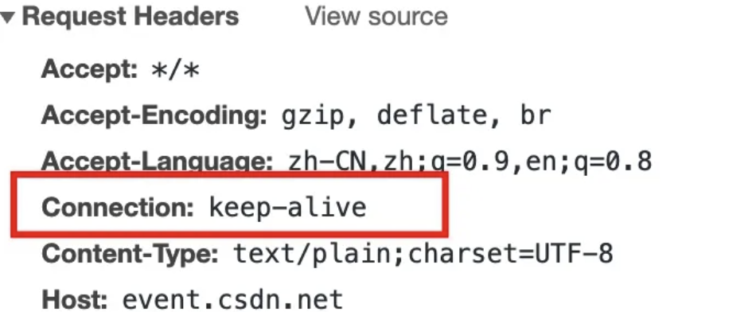

## HTTP 0.9

HTTP 0.9 是最早发布出来的一个版本，于1991年发布。

它只接受 GET 一种请求方法，没有在通讯中指定版本号，且不支持请求头。由于该版本不支持 POST 方法，因此客户端无法向服务器传递太多信息。

HTTP 0.9 具有典型的无状态性，每个事务独立进行处理，事务结束时就释放这个连接。HTTP 协议的无状态特点在其第一个版本中已经成型。

## HTTP 1.0

HTTP 1.0是HTTP协议的第二个版本，于1996年发布，如今仍然被广泛使用，尤其是在代理服务器中。

这是第一个在通讯中指定版本号的HTTP协议版本，具有以下特点：

- 不仅仅支持 GET 命令，还支持 POST 和 HEAD 等请求方法。
- HTTP 的请求和回应格式也发生了变化，除了要传输的数据之外，每次通信都包含头信息，用来描述一些信息。
- 不再局限于 0.9 版本的纯文本格式
  根据头信息中的 Content-Type 属性，可以支持多种数据格式，这使得互联网不仅仅可以用来传输文字，还可以传输图像、音频、视频等二进制文件。
- 开始支持cache，就是当客户端在规定时间内访问同一网站，直接访问cache即可。
- 其他的新增功能还包括状态码（status code）、多字符集支持、多部分发送（multi-part type）、权限（authorization）、缓存（cache）、内容编码（content encoding）等。

1.0 版本的工作方式是每次 TCP 连接只能发送一个请求，当服务器响应后就会关闭这次连接，下一个请求需要再次建立 TCP 连接。 TCP 连接的建立成本很高，因为需要客户端和服务器三次握手，并且开始时发送速率较慢（slow start）。

HTTP 1.0 版本的性能比较差。随着网页加载的外部资源越来越多，这个问题就愈发突出了。为了解决这个问题，有些浏览器在请求时，即在请求头部加上 `Connection` 字段。

这个字段要求服务器不要关闭TCP连接，以便其他请求复用。服务器同样回应这个字段。

一个可以复用的TCP连接就建立了，直到客户端或服务器主动关闭连接。但是，这不是一个标准字段，不同实现的行为可能不一致，因此不是根本的解决办法。

## HTTP 1.1

默认采用持续连接（Connection: keep-alive），能很好地配合代理服务器工作。

还支持以[管道方式](https://link.zhihu.com/?target=https%3A//zh.wikipedia.org/wiki/HTTP%E7%AE%A1%E7%BA%BF%E5%8C%96)在同时发送多个请求，以便降低线路负载，提高传输速度。

HTTP 1.1 具有以下特点：

- 引入了持久连接（persistent connection）
  即 TCP 连接默认不关闭，可以被多个请求复用，不用声明 `Connection: keep-alive`。客户端和服务器发现对方一段时间没有活动，就可以主动关闭连接。不过，规范的做法是，客户端在最后一个请求时，发送 `Connection: close`，明确要求服务器关闭 TCP 连接。
- 加入了**管道机制**
  在同一个 TCP 连接里，允许多个请求同时发送，增加了并发性，进一步改善了 HTTP 协议的效率。
  举例来说，客户端需要请求两个资源。以前的做法是，在同一个 TCP 连接里面，先发送 A 请求，然后等待服务器做出回应，收到后再发出 B 请求。
  管道机制则是允许浏览器**同时发出** A 请求和 B 请求，但是服务器还是按照顺序，先回应 A 请求，完成后再回应 B 请求。
  一个 TCP 连接现在可以传送多个回应，势必就要有一种机制，区分数据包是属于哪一个回应的。这就是 `Content-length` 字段的作用，声明本次回应的数据长度。
- 分块传输编码
  使用 `Content-Length` 字段的前提条件是，服务器发送回应之前，必须知道回应的数据长度。对于一些很耗时的动态操作来说，这意味着，服务器要等到所有操作完成，才能发送数据，显然这样的效率不高。
  更好的处理方法是，产生一块数据，就发送一块，采用"流模式"（stream）取代"缓存模式"（buffer）。
  因此，HTTP 1.1 版本规定可以不使用 `Content-Length` 字段，而使用"分块传输编码"（chunked transfer encoding）。只要请求或回应的头信息有 `Transfer-Encoding` 字段，就表明回应将由数量未定的数据块组成。
- 新增了请求方式 PUT、PATCH、OPTIONS、DELETE 等。
- 客户端请求的头信息新增了 Host 字段，用来指定服务器的域名。
- HTTP 1.1 支持文件断点续传，RANGE:bytes，HTTP 1.0 每次传送文件都是从文件头开始，即 0 字节处开始。RANGE:bytes=XXXX 表示要求服务器从文件 XXXX 字节处开始传送，断点续传。即返回码是 206（Partial Content）

## HTTP/2.0

这也是最新的 HTTP 版本，于 2015 年 5 月作为互联网标准正式发布。

它具有以下特点：

- 二进制协议
  HTTP 1.1 版的头信息肯定是文本（ASCII 编码），数据体可以是文本，也可以是二进制。
  HTTP 2.0 则是一个彻底的二进制协议，头信息和数据体都是二进制，并且统称为"帧"（frame）：头信息帧和数据帧。

- 多工
  HTTP 2.0 复用 TCP 连接，在一个连接里，客户端和浏览器都可以同时发送多个请求或回应，而且不用按照顺序一一对应，这样就避免了"队头堵塞"（HTTP 2.0 使用了多路复用的技术，做到同一个连接并发处理多个请求，而且并发请求的数量比 HTTP 1.1大了好几个数量级）。
  举例来说，在一个 TCP 连接里面，服务器同时收到了 A 请求和 B 请求，于是先回应 A 请求，结果发现处理过程非常耗时，于是就发送 A 请求已经处理好的部分， 接着回应 B 请求，完成后，再发送 A 请求剩下的部分。

- 头信息压缩
  HTTP 协议不带有状态，每次请求都必须附上所有信息。所以，请求的很多字段都是重复的，比如 `Cookie` 和 `User Agent`，一模一样的内容，每次请求都必须附带，这会浪费很多带宽，也影响速度。
  HTTP 2.0 对这一点做了优化，引入了头信息压缩机制（header compression）。一方面，头信息使用 gzip 或c ompress 压缩后再发送；另一方面，客户端和服务器同时维护一张头信息表，所有字段都会存入这个表，生成一个索引号，以后就不发送同样字段了，只发送索引号，这样就提高速度了。

- 服务器推送
  HTTP 2.0 允许服务器未经请求，主动向客户端发送资源，这叫做服务器推送（server push）。意思是说，当我们对支持 HTTP 2.0 的 web server 请求数据的时候，服务器会顺便把一些客户端需要的资源一起推送到客户端，免得客户端再次创建连接发送请求到服务器端获取。这种方式非常合适加载静态资源。 服务器端推送的这些资源其实存在客户端的某处地方，客户端直接从本地加载这些资源就可以了，不用走网络，速度自然是快很多的。

  ## 总结

  HTTP/0.9：功能捡漏，只支持GET方法，只能发送HTML格式字符串。

  HTTP/1.0：支持多种数据格式，增加POST、HEAD等方法，增加头信息，每次只能发送一个请求（无持久连接）

  HTTP/1.1：默认持久连接、请求管道化、增加缓存处理、增加Host字段、支持断点传输分块传输等。

  HTTP/2.0：二进制分帧、多路复用、头部压缩、服务器推送