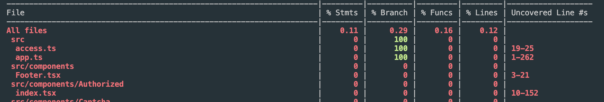

## 一、基本语法（匹配器 matchers）

### 1.基础语法

```js
test('two plus two is four', () => {
  expect(2 + 2).toBe(4)
})
```

`expect()`返回被称作“expectation”的对象。`toBe()`被称作 matcher。Jest 会对两者进行比较并输出测试结果。

相应的，`expect()`和`toBe()`还可以调用被测的 function

```js
test('two plus two is four', () => {
  const add = 2 + 2
  const value = 4
  expect(add).toBe(value)
})
12345
```

还可以用 not.toBe():

```js
expect(add).not.toBe(value)
```

### 2.比较 null,undefined,true,false

```js
expect(n).toBeNull() // 比较是否为null
expect(n).toBeDefined() // 比较是否为defined
expect(n).not.toBeUndefined() // 比较是否为undefined
expect(n).not.toBeTruthy() // 比较是否为true
expect(n).toBeFalsy() // 比较是否为false
```

### 3.比较 number

```js
expect(value).toBe(4)
expect(value).toEqual(4)
expect(value).toBeGreaterThan(11) // value比较是否大于11
expect(value).toBeLessThan(11) // value比较是否小于11
expect(value).toBeGreaterThanOrEqual(11) // value比较是否大于等于11
expect(value).toBeLessThanOrEqual(11) // value比较是否小于等于11
expect(0.1 + 0.2).toBeCloseTo(0.3) // 浮点数比较
```

对于 number，toBe()和 toEqual()两者在大部分时候都是等价的

### 4.比较 string

使用`toMatch()`方法

```js
test('there is no I in team', () => {
  expect('team').not.toMatch(/I/) // 是否不包含I字符串（可以直接写字符串）
})

test('but there is a "stop" in Christoph', () => {
  expect('Christoph').toMatch(/stop/) // 是否包含stop字符串（可以直接写字符串）
})
```

### 5.比较 Arrays，Set

使用`toContain()`方法

```js
const shoppingList = ['diapers', 'kleenex', 'trash bags', 'paper towels', 'beer']

test('the shopping list', () => {
  expect(shoppingList).toContain('beer') // 数组中包含beer
  expect(shoppingList).not.toContain('pork') // 数组中不包含pork
})
```

### 6.匹配引用类型

```js
test('引用类型', () => {
  const a = { one: 1 }
  expect(a).toEqual({ one: 1 })
})
```

### 7.异常

```js
const throwNewErrorFunc = () => {
  throw new Error('this is a new error')
}

test('toThrow', () => {
  expect(throwNewErrorFunc).toThrow() // 是否抛出异常
  expect(throwNewErrorFunc).toThrow('this is a new error') // 是否抛出异常并且异常为'this is a new error'
  expect(throwNewErrorFunc).not.toThrow() // 是否不抛出异常
})
```

### 8.更多 expect 用法

请查询 Jest 官方文档，链接[官方文档](https://jestjs.io/docs/en/expect)

## 二、测试覆盖率

1. 生成测试覆盖率

```shell
// Jest 运行
npx jest --coverage
```

```shell
// umi 运行
run test --coverage
```

会在项目根目录生成 coverage 文件夹可以查看生成的测试用例覆盖率。

2. 命令行生成示例



**Statements**: 代码测试声名语句测试

**Branches**: 分支语句 if else

## 热重载测试用例

命令

```shell
npm run jest --watchAll
```

A 模式当有测试用例改变时会自动重新执行所有测试用例

```shell
npm run jest --watch
```

默认为 o 模式。o 模式只会执行更改测试用例的文件

f 模式只会对之前没有通过的测试用例测试。

t 模式根据测试用例的名字匹配，只会执行匹配到的测试用例。（可以只写名字的部分可以过滤到）

p 模式根据测试文件名匹配，只会执行匹配到的测试文件中的测试用例。

q 退出测试监控。

Enter 重新执行测试用例。

## 三、异步测试（例如接口测试）

done 函数只有调用 done 函数时才测试结束

```js
// 回调类型异步测试
test('请求结果为{ success: true }', (done) => {
  fetchData((data) => { // fetchData 为axios 请求
    expect(data).toEqual({
      success: true
    })
    done();
  })
})

// promise类型异步测试1
test('请求结果为{ success: true }', () => {
  return fetchData((data).then((response) => {
   expect(response.data).toEqual({
      success: true
    })
  })
})

// promise类型异步测试2
test('请求结果为{ success: true }', () => {
  return expect(fetchData()).resolves.toMatchObject({
    data: {
      success: true
		}
  })
})

// promise类型异步测试3
test('请求结果为{ success: true }', async () => {
  await expect(fetchData()).resolves.toMatchObject({
    data: {
      success: true
		}
  })
})

// promise类型异步测试4
test('请求结果为{ success: true }', async () => {
  const response = await fetchData();
  expoect(response.data).toEqual({
    success: true
  })
})

 // 返回404测试
  test('请求结果为404', () => {
    expect.assertions(1); // 下面必须执行1个expect 为了解决catch 成功时不会执行，参数2代表必须执行2个expect
    return fetchData((data).catch((e) => {
     expect(e.toString().indexOf('404') > -1).toBe(true)
    })
	})

 // 返回404测试
  test('请求结果为404', () => {
    return expect(fetchData()).rejects.toThrow();
	})

 // 返回404测试
  test('请求结果为404', async () => {
    await expect(fetchData()).rejects.toThrow();
	})

 // 返回404测试
  test('请求结果为404', async () => {
    expect.assertions(1);
    try {
      await fetchData();
    } catch(e) {
      expect(e.toString()).toEqual("Error: Request failed with status code");
    }
	})

```

## 四、钩子函数

### beforeAll

所有测试用例调用之前

### afterAll

所有测试用例调用之后

### beforeEach

每个测试用例执行之前

### afterEach

每个测试用例调用之后

### describe

```js
describe("测试分组", () => {
	// 这里可以写多个test也可以嵌套 beforeAll afterAll beforeEach afterEach 可以理解为作用域
	....
})
```

### test.only

会忽略其他测试代码，只执行.only 的测试

## 五、jest Mock

1. 捕获函数的调用和返回结果，以及 this 和调用顺序

2. 它可以让我们自由的设置返回结果

3. 改变函数的内部实现

### 1、回调函数测试

```js
// 待测试代码
const runCallback = (callback) => {
  callback()
}

// 测试代码
test('测试 runCallback', () => {
  const func = jest.fn() // mock函数，捕获函数的调用

  func.mockReturnValueOnce('a') // 设置第一次返回a
  func.mockReturnValueOnce('b') // 设置第二次返回b
  func.mockReturnValueOnce('c') // 设置第二次返回c  (可以链式调用)

  func.mockImplementationOnce(() => {
    // 设置返回值还可以做其他操作
    return 'abc'
  })

  func.mockReturnValue('abc') // 设置所有的调用返回值为abc

  runCallback(func)
  runCallback(func)
  expoect(func).toBeCalled() // 回调函数是否被调用
  expect(func.mock.calls.length).toBe(2) // 回调函数是否执行了2次
  expect(func.mock.calls[0]).toEqual(['abc']) // 回调函数的参数是abc

  expect(func.mock.results[0].value).toBe('abc') // 判断返回是不是abc

  expect(func).toBeCalledWith('abc') // 每次返回都是abc
})
```

### 2、请求测试

请求测试的返回结果应该是后端自动化测试内容，所以可以使用 jest mock 模拟 axios 请求不发送真实请求。

```js
import axios from 'axios'
jest.mock('axios')

test('测试 请求', async () => {
  // 改变函数的内部实现
  axios.get.mockResolvedValue({ data: 'hello' })

  axios.get.mockResolvedValueOnce({ data: 'hello' })
  axios.get.mockResolvedValueOnce({ data: 'world' })

  await getData().then((data) => {
    expoect(data).toBe('hello')
  })

  await getData().then((data) => {
    expoect(data).toBe('world')
  })
})
```

发送请求也可以单独定义使用 jest.mock

```js
jest.mock('./demo') // 模拟的请求直接写一个promise
jest.unmock('./demo') // 取消mock模拟
import { fetchData } from './demo' // 真实的发送请求
const { getNunber } = jest.requireActual('./demo') // 在自动匹配mock文件时该方法可以直接使用原文件中的方法

test('fetchData 测试', () => {
  return fetchData().then((data) => {
    expect(eval(data)).toEqual('123')
  })
})
```

如果开启了自动 mock 会自动匹配到当前目录下`__mocks__`文件下的同名文件会自动替换为 mock 文件。

## 六、snapshot 快照测试

一般用来测试配置文件

```js
const generateConfig = () => {
  return {
    server: 'http://localhost',
    port: 8080,
    domain: 'localhost',
    time: '2019',
  }
}

test('测试 配置文件', () => {
  expect(generateConfig()).toMatchSnapshot()
})

// 假如 generateConfig 的time 为 new Date() 动态变化的

test('测试 配置文件', () => {
  expect(generateConfig()).toMatchSnapshot({
    time: expect.any(Date), // 可以为string /number 等
  })
})

test('测试 配置文件', () => {
  expect(generateConfig()).toMatchInlineSnapshot(
    {
      time: expect.any(Date), // 可以为string /number 等
    },
    `会在这里直接生成快照`
  )
})
```

u 更新快照

i 逐个确认按 u 后逐个更新

s 跳过该快照提示

## 七、定时器测试

```js
jest.useFakeTimers() // 下面的定时器使用jestmock的

beforeeach(() => {
  jest.useFakeTimers() // 这样调用可以解决多个定时器测试问题
})

test('timer 测试', (done) => {
  const fn = jest.fn()
  timer(fn)
  jest.runAllTimers() // 马上执行不需要等定时器（所有的都执行）
  jest.runOnlyPendingTimers() // 只执行队列中的一个（用来解决多个定时器嵌套）
  jest.advanceTimersByTime(3000) // 快进3s执行 快进时间
  expect(fn).toHaveBeenCalledTimes(1) // 是否调用一次回调函数
})
```

## 八、类的测试

```js
import Util from './util'

const util = null

beforeAll(() => {
  utiil = new Util()
})

test('测试 a 方法', () => {
  expoect(util.a(1, 2)).toBe('12')
})
```

```js
jset.mock('./util', () => {
  const Until = jest.fn(() => {
    console.log('constructor')
  });
  Until.prototype.a = jest.fn(() => {
    console.log(a)
  })
  Until.prototype.b = jest.fn(() => {
    console.log(b)
  })
  return Until;
};
import Util from './util';
import demoFunction from './demo';

test('测试 demoFunction 方法', () => {
  demoFunction();
  expoect(util).toHaveBeenCalled();
  expoect(util.mock.instances[0].a).toHaveBeenCalled(); // 是否调用了util 类中的a方法
  expoect(util.mock.instances[0].b).toHaveBeenCalled(); // 是否调用了util 类中的b方法
})
```

## 九、dom 节点操作

jest 自己模拟了 dom 的 api

```js
import addDivToBody from './demo'
import $ from 'jquery'

test('测试 addDivToBody', () => {
  addDivToBody()
  addDivToBody()
  expect($('body').find('div').length).toBe(2)
})
```
