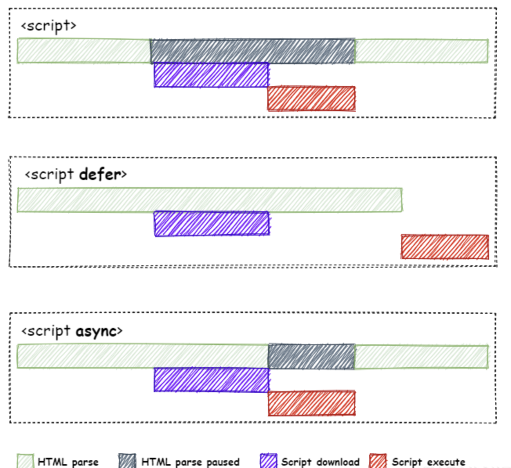

script 标签可以放置在 html 任意位置，head、body，甚至是 div 里。它们——无论是内联还是外置——的执行顺序基本上（async 和 defer 除外）秉承由上至下串行执行的原则。浏览器首次加载 script 期间，还会阻塞 HTML 页面解析；尤其是外置引入 JS，需要经历网络传输、解析和执行，有时候会导致浏览器白屏。所以谈到首屏渲染的时候，我们往往会建议将 script 标签放到 `<body>` 元素的最下方——先呈现页面再执行 JS。

此外，在 script 执行期间，它可以获取到所有出现在它上方的 JS 全局变量和 DOM 元素；这导致在一些垃圾代码里，全局元素经常无缘无故被其他代码块污染了。

### 加载（async & defer）

我们通过把 script 标签放到 `<body>` 底部加快首屏渲染速度。现代浏览器还可以使用其他的手段，比如 defer（延迟加载）和 async（异步加载）

#### defer

defer 是 script 里的一个布尔属性，设计目的是将该脚本的执行放到文档完成解析后、DOMContentLoaded（约等于 jQuery.ready）事件前。

此外，当存在多个 defer 脚本时，html5 标准要求按出现顺序执行脚本；但在现实中，浏览器厂商并不那么遵循标准：defer 脚本不一定顺序执行，甚至不一定会排在 DOMContentLoaded 事件前。因此通常的建议是：最好只含一个延迟脚本。

#### async

async 也是 script 标签里的一个属性，该属性也能够消除部分 JS 阻塞。当加上 async 属性后，script 脚本的网络请求便可以并行于 HTML 页面解析发生；并尽快解析和执行该 JS 脚本。

### **相同之处**：

`script`标签的`defer`和`async`属性都是去异步加载外部的`JS`脚本文件，加载的过程中不会阻塞浏览器对`HTML`的解析过程（**注意：这里说的仅仅是加载的过程**）

### **不同之处**：

- **执行是否会阻塞HTML解析**：`defer`属性的`script`标签在执行的过程中一定不会阻塞`HTML`的解析，因为它执行的时刻一定是在`HTML`解析完全之后；`async`属性的`script`标签可能会阻塞`HTML`的解析，具体得看`async`脚本加载完成时`HTML`文档是否被解析完全，如果还没被解析完全，则会阻塞`HTML`的解析去执行脚本，如果`HTML`已经被解析完全了，执行脚本的时候也就没有机会阻塞HTML解析了
- **执行顺序**：多个`async`属性的`script`标签，不可以保证最后的执行顺序一定按照`HTML`文档中的顺序来；多个`defer`的`script`标签，一定会按照文档中的顺序执行